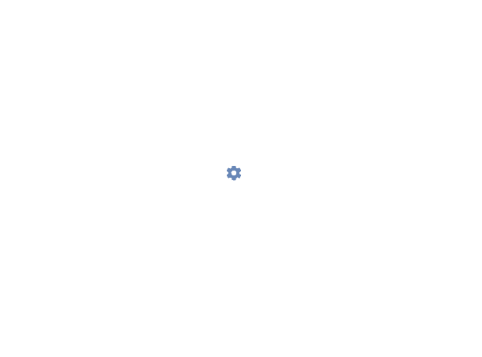

# Tensor test task

#### To run this project, first you need to install all npm packages, running "npm install" in console.    Then you need to run app, running "npm start" in console.
### Demo:

#### Компоненты:
##### ActionButtons - комопнент с двумя кнопками apply и cancel. Принимает в себя два обработчика на каждую кнопку, обработчик может выполнять любую функцию, нужную для выполнения.

##### SectionEdditor - компоненят для выбора и изменения цвета входящих в него элементов, чтобы изменять их цвет. Создаётся из количества элементов, которые отправляются в комопнент и принимае в себя данны этих элементов, включаяя имя и цвет. Можно использовать с любым цветом и именем.

##### SectionBlock - компонент для рендера разделов которые приходят как свойства компонента. Количество разделов зависит от конфига, отправляемого в компонент. Так же использует название раздела, его описания, и цвета элементов входящих в него.

##### StylingHeader - это хэдер комопнента, применяется на всех этапах компонента, после его вызова. Состоит из ActionButtons и названия раздела, где он применяется. Принимает в себя как пропс обработчики и передаёт их в ActionButtons.